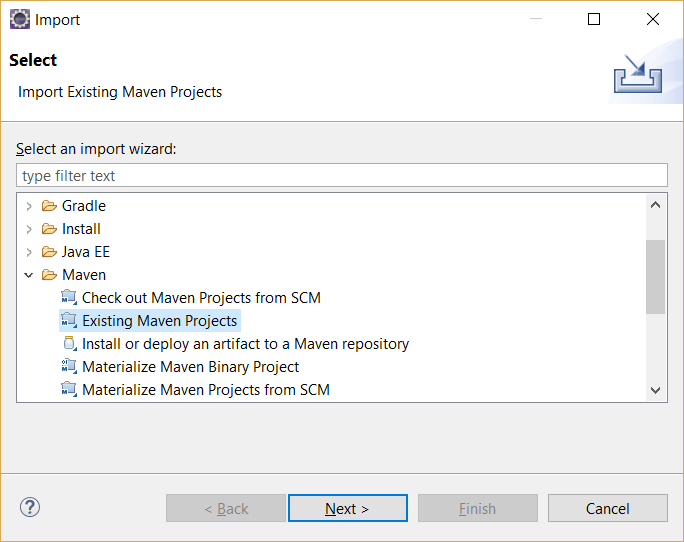
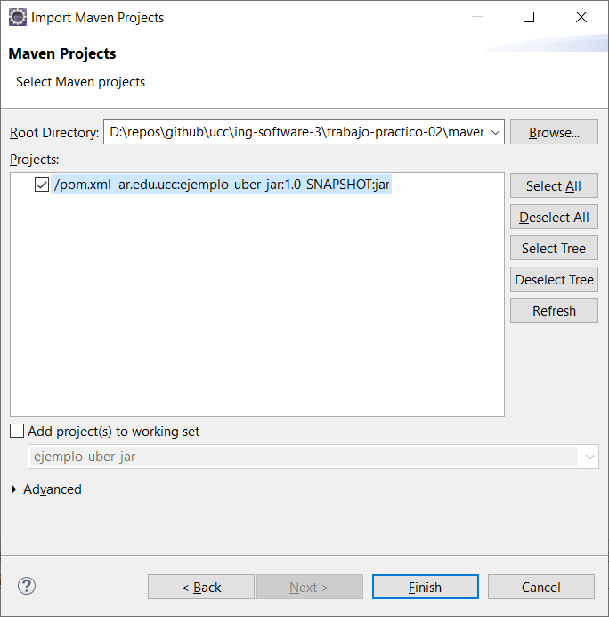

## Trabajo Práctico 5 - Herramientas de construcción de software

### 1- Objetivos de Aprendizaje
 - Utilizar herramientas de construcción de software y manejo de paquetes y dependencias
 - Familiarizarse con las herramientas más utilizadas en el lenguaje Java.

### 2- Unidad temática que incluye este trabajo práctico
Este trabajo práctico corresponde a la unidad Nº: 3 (Libro Continuous Delivery: Cap 6 y 13)

### 3- Consignas a desarrollar en el trabajo práctico:
  - Las aplicaciones utilizadas son del tipo "Hello World", dado que el foco del trabajo práctico es como construirlas y no el funcionamiento de la aplicación en sí.
  - En los puntos en los que se pida alguna descripción, realizarlo de la manera más clara posible.

### 4- Desarrollo:

#### 1- Instalar Java JDK si no dispone del mismo. 
  - Java 8 es suficiente, pero puede utilizar cualquier versión.
  - Utilizar el instalador que corresponda a su sistema operativo 
  - http://www.oracle.com/technetwork/java/javase/downloads/jdk8-downloads-2133151.html
  - Agregar la variable de entorno JAVA_HOME
    - En Windows temporalmente se puede configurar
    ```bash
      SET JAVA_HOME=C:\Program Files\Java\jdk1.8.0_221
    ```
    - O permanentemente entrando a **Variables de Entorno** (Winkey + Pausa -> Opciones Avanzadas de Sistema -> Variables de Entorno)
  - Otros sistemas operativos:
    - https://www3.ntu.edu.sg/home/ehchua/programming/howto/JDK_Howto.html
    - https://www.digitalocean.com/community/tutorials/how-to-install-java-with-apt-on-ubuntu-18-04


#### 2- Instalar Maven
- Instalar maven desde https://maven.apache.org/download.cgi (última versión disponible 3.6.1)
- Descomprimir en una carpeta, por ejemplo C:\tools
- Agregar el siguiente directorio a la variable de entorno PATH, asumiendo que los binarios de ant están en C:\tools\apache-maven-3.6.1\bin

  ```bash   
    SET PATH=%PATH%;C:\tools\apache-maven-3.6.1\bin
  ```  
- Se puede modificar permanentemente la variable PATH entrando a (Winkey + Pausa -> Opciones Avanzadas de Sistema -> Variables de Entorno)
- En Linux/Mac se puede agregar la siguiente entrada al archivo ~/.bash_profile

  ```bash
  export PATH=/opt/apache-maven-3.6.1/bin:$PATH
  ```

#### 3- Introducción a Maven
- Qué es Maven?
- Qué es el archivo POM?
    1. modelVersion
    2. groupId
    3. artifactId
    4. versionId
- Repositorios Local, Central y Remotos http://maven.apache.org/guides/introduction/introduction-to-repositories.html
- Entender Ciclos de vida de build
  - default
  - clean
  - site
  - Referencia: http://maven.apache.org/guides/introduction/introduction-to-the-lifecycle.html#Build_Lifecycle_Basics
- Comprender las fases de un ciclo de vida, por ejemplo, default:

| Fase de build | Descripción                                                                                                                            |
|---------------|----------------------------------------------------------------------------------------------------------------------------------------|
| validate      | valida si el proyecto está correcto y toda la información está disponible                                                             |
| compile       | compila el código fuente del proyecto                                                                                 |
| test          | prueba el código fuente compilado utilizando un marco de prueba de unidad adecuado. Estas pruebas no deberían requerir que el código se empaquete o implemente |
| package       | toma el código compilado y lo empaqueta en su formato distribuible, como un JAR.                                                     |
| verify        | ejecuta cualquier verificación de los resultados de las pruebas de integración para garantizar que se cumplan los criterios de calidad                                                      |
| install       | instal1 el paquete en el repositorio local, para usarlo como dependencia en otros proyectos localmente                                       |
| deploy        | hecho en el entorno de compilación, copia el paquete final en el repositorio remoto para compartirlo con otros desarrolladores y proyectos.      |

- Copiar el siguiente contenido a un archivo, por ejemplo ./trabajo-practico-02/maven/vacio/pom.xml

```xml
<project xmlns="http://maven.apache.org/POM/4.0.0"
         xmlns:xsi="http://www.w3.org/2001/XMLSchema-instance"
         xsi:schemaLocation="http://maven.apache.org/POM/4.0.0
                      http://maven.apache.org/xsd/maven-4.0.0.xsd">
    <modelVersion>4.0.0</modelVersion>

    <groupId>ar.edu.ucc</groupId>
    <artifactId>proyecto-01</artifactId>
    <version>0.1-SNAPSHOT</version>
</project>
```

- Ejecutar el siguiente comando en el directorio donde se encuentra el archivo pom.xml
```
mvn clean install
```

- Sacar conclusiones del resultado

#### 4- Maven Continuación

- Generar un proyecto con una estructura inicial:

```bash
mvn archetype:generate -DgroupId=ar.edu.ucc -DartifactId=ejemplo -DarchetypeArtifactId=maven-archetype-quickstart -DinteractiveMode=false
```

- Analizar la estructura de directorios generada:

```
.
└── ejemplo
    ├── pom.xml
    └── src
        ├── main
        │   └── java
        │       └── ar
        │           └── edu
        │               └── ucc
        │                   └── App.java
        └── test
            └── java
                └── ar
                    └── edu
                        └── ucc
                            └── AppTest.java

12 directories, 3 files
```

- Compilar el proyecto

```bash
mvn clean package
```

- Analizar la salida del comando anterior y luego ejecutar el programa

```
java -cp target/ejemplo-1.0-SNAPSHOT.jar ar.edu.ucc.App
```

#### 6- Manejo de dependencias

- Crear un nuevo proyecto con artifactId **ejemplo-uber-jar**

- Modificar el código de App.java para agregar utilizar una librería de logging:

```java
package ar.edu.ucc;

import org.slf4j.Logger;
import org.slf4j.LoggerFactory;

/**
 * Hello world!
 *
 */
public class App 
{
    public static void main( String[] args )
    {
        Logger log = LoggerFactory.getLogger(App.class);
        log.info("Hola Mundo!");
    }
}
```

- Compilar el código e identificar el problema.

- Agregar la dependencia necesaria al pom.xml

```xml
    <dependency>
      <groupId>ch.qos.logback</groupId>
      <artifactId>logback-classic</artifactId>
      <version>1.2.1</version>
    </dependency>
```

- Verificar si se genera el archivo jar y ejecutarlo

```bash
java -cp target\ejemplo-uber-jar-1.0-SNAPSHOT.jar ar.edu.ucc.App
```

- Sacar conclusiones y analizar posibles soluciones

- Implementar la opción de uber-jar: https://maven.apache.org/plugins/maven-shade-plugin/

```xml
  <build>
    <plugins>
      <plugin>
        <groupId>org.apache.maven.plugins</groupId>
        <artifactId>maven-shade-plugin</artifactId>
        <version>2.0</version>
        <executions>
          <execution>
            <phase>package</phase>
            <goals>
              <goal>shade</goal>
            </goals>
            <configuration>
              <finalName>${project.artifactId}</finalName>
              <transformers>
                <transformer implementation="org.apache.maven.plugins.shade.resource.ManifestResourceTransformer">
                  <mainClass>ar.edu.ucc.App</mainClass>
                </transformer>
              </transformers>
              <minimizeJar>false</minimizeJar>
            </configuration>
          </execution>
        </executions>
      </plugin>
    </plugins>
  </build>
```
- Volver a generar la salida y probar ejecutando

```bash
java -jar target\ejemplo-uber-jar.jar
```

#### 7- Utilizar una IDE
  - Importar el proyecto anterior en Eclipse o Intellij como maven project:
    - Si no dispone de Eclipse puede obtenerlo desde este link http://www.eclipse.org/downloads/packages/release/2018-09/r/eclipse-ide-java-ee-developers
    - Para importar, ir al menú Archivo -> Importar -> Maven -> Proyecto Maven Existente:

    - Seleccionar el directorio donde se encuentra el pom.xml que se generó en el punto anterior. Luego continuar:


  - Familiarizarse con la interfaz grafica
    - Ejecutar la aplicación
    - Depurar la aplicación
    - Correr unit tests y coverage
    - Ejecutar los goals de maven
    - Encontrar donde se puede cambiar la configuración de Maven.
    - etc.

#### 8- Ejemplo con nodejs

- Instalar Nodejs: https://nodejs.org/en/

- Crear una nueva aplicación
```bash
npx create-react-app my-app
```

- Ejecutar la aplicación
```bash
cd my-app
npm start
```

- La aplicación web estará disponible en http://localhost:3000

- Analizar el manejo de paquetes y dependencias realizado por npm.


#### 9- Ejemplo con python
- Instalar dependencias (Ejemplo Ubuntu) varía según el OS:
```
sudo apt install build-essential python3-dev
pip3 install cookiecutter
```
- Correr el scaffold
```bash
$ cookiecutter https://github.com/candidtim/cookiecutter-flask-minimal.git
application_name [Your Application]: test
package_name [yourapplication]: test
$
```
- Ejecutar la aplicación
```bash
cd test
make run
```
- Acceder a la aplicación en: http://localhost:5000/
- Explicar que hace una tool como cookiecutter, make y pip.

#### 10- Build tools para otros lenguajes
- Hacer una lista de herramientas de build (una o varias) para distintos lenguajes, por ejemplo (Rust -> cargo)
- Elegir al menos 10 lenguajes de la lista de top 20 o top 50 de tiobe: https://www.tiobe.com/tiobe-index/


#### 11- Presentación

- Subir todo el código, ejemplos y respuestas a una carpeta trabajo-practico-05.

> Tip: Agregar un archivo .gitignore al repositorio para evitar que se agreguen archivos que son resultado de la compilación u otros binarios, que no son necesarios, al mismo.
